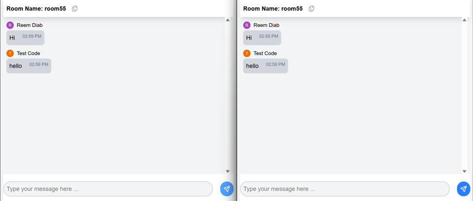

# ChatApp
A real-time chat application built with React and Firebase. Users can sign in, join chat rooms, and exchange messages instantly.

# Features
- Real-time chat (Firebase)
- Authentication (Firebase Auth)
- Responsive UI with Tailwind CSS
- Cookie-based session helpers (universal-cookie)

# Tech stack
- React + Vite
- Tailwind CSS
- Firebase (Auth/Firestore/Realtime)

# Screenshots

